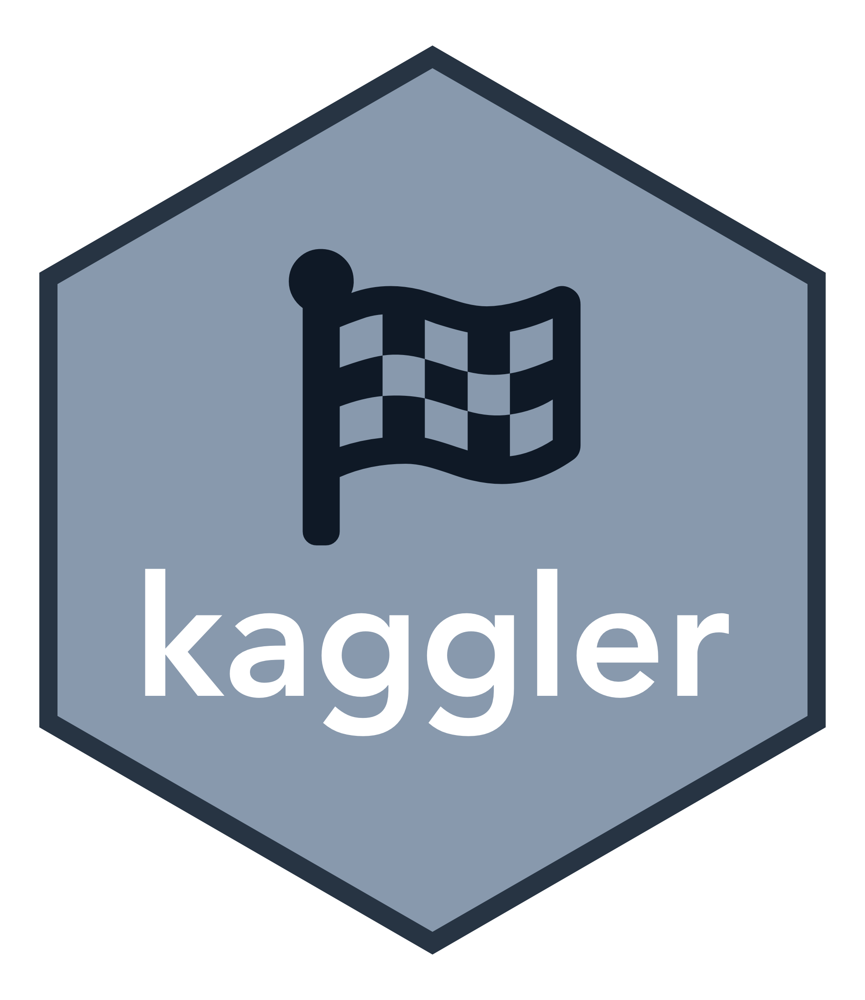

<!-- README.md is generated from README.Rmd. Please edit that file -->

---

```{r setup, include = FALSE}
knitr::opts_chunk$set(
  collapse = TRUE,
  comment = "#>",
  fig.path = "man/figures/README-",
  out.width = "100%",
  cache = TRUE
)
library(kaggler)
options(width = 100)
options(tibble.print_min = 5)
options(tibble.print_max = 5)
```
# kaggler 

> 🏁 An R client for accessing [Kaggle](https://www.kaggle.com)'s API

<!-- badges: start -->
[](https://github.com/KoderKow/kaggler/actions)
<!-- badges: end -->

## Installation

You can install the dev version of **{kaggler}** from [CRAN](https://github.com/mkearney/kaggler) with:

```{r, eval = FALSE}
## install kaggler package from github
devtools::install_packages("koderkow/kaggler")
```

## API authorization

<span>1.</span> Go to [https://www.kaggle.com/](kaggle.com) and sign in

<span>2.</span> Click `Account` or navigate to `https://www.kaggle.com/{username}/account`

<span>3.</span> Scroll down to the `API` section and click `Create New API Token` (which should cause you to download a `kaggle.json` file with your username and API key)

<p style='align:center'></p>

<span>4.</span> There are a few different ways to store your credentials

  - Save/move the `kaggle.json` file as `~/.kaggle/kaggle.json`
  - Save/move the `kaggle.json` file to your current working directory
  - Enter your `username` and `key` and use the `kgl_auth()` function like in the example below 

```{r, eval = FALSE}
library(kaggler)

kgl_auth(username = "koderkow", key = "example")
#> Your Kaggle key has been recorded for this session and saved as `KAGGLE_PAT` environment variable for future sessions.
```

# Kaggle Flow

This is an **experimental** and **opinionated** reproducible workflow for working with Kaggle competitions. The Kaggle Flow will always check  if the competition rules are accepted and the data files for the competition are readily available. If they are not, they will be downloaded.

## ID input

Find the competition you want to work on. Methods have been built out to accept multiple forms of `id`.

1. The competition URL
    - `https://www.kaggle.com/c/titanic` and `https://www.kaggle.com/c/titanic/code` will recognize `titanic` as the ID
2. Kaggle's API command
    - Kaggles official API is built in python and they supply a command to download the data on the data tab of a competition. The download functions will take `kaggle competitions download -c titanic`and recognize the ID as `titanic`
3. Explicit ID
    - If the above two cases don't match in the logic then everything else will be considered an ID
    - Example; entering `titanic` directly

## Example Work Flow

The flow will always check if the user have accepted the rules to the competition. If the rules have not been accepted, a prompt will be shown notifying the user of the error and an input to take the user to the competitions rules.

```r
kgl_flow(id = "tabular-playground-series-jun-2021")

#> x You must accept this competition's rules before you'll be able to download files.
#> Would you like to visit 'https://www.kaggle.com/c/tabular-playground-series-jun-2021/rules' to  accept the rules?
#> 
#> 1: Nope
#> 2: Yup
#> 3: No way
```

Now lets switch to a different project and a competition my account has accepted the rules for. Running `kgl_flow()` will download all the files I need and also store some metadata to keep track of the competition ID and information about the competitions data files.

```{r}
kgl_flow("titanic")
```

The files have been saved into a new directory; `_kaggle_data`.

```{r}
fs::dir_ls("_kaggle_data")
```

We can get some information about our competition data by looking at the metadata.

```r
kgl_flow_meta()

#> ℹ Competition ID: 'titanic'
#> # A tibble: 3 x 10
#>   id     ref      name    description                total_bytes url      creation_date       download_time       nrows ncols
#>   <chr>  <chr>    <chr>   <chr>                            <int> <chr>   <dttm>              <dttm>              <int> <int>
#> 1 titan… gender_… gender… "An example of what a sub…        3258 https:… 2018-04-09 05:33:22 2021-08-26 16:19:50   418     2
#> 2 titan… test.csv test.c… "test data to check the a…       28629 https:… 2018-04-09 05:33:22 2021-08-26 16:19:51   418    11
#> 3 titan… train.c… train.… "contains data "                 61194 https:… 2018-04-09 05:33:22 2021-08-26 16:19:52   891    12
```

If the competitions data is all in csv format, then they can easily be loaded in.

```r
kgl_flow_load()

#> ℹ Competition ID: 'titanic'
#> ✓ The data has been loaded into the global environment!
#>   - 'gender_submission'
#>   - 'test'
#>   - 'train'
```

In an unwanted situation where one of the files gets accidentily deleted, kgl_flow_load() will reference the metadata to make sure all files are available before loading them in.

```r
fs::file_delete("_kaggle_data/train.csv")

kgl_flow_load()
#> x There seem to be files missing! Run 'kgl_flow()' to make sure all files are present.
```

As prompted, we can run `kgl_flow()` again to get the files back.

```r
kgl_flow()

#> ℹ These files are detected in '_kaggle_data/' and will not be downloaded:
#>   - 'gender_submission'
#>   - 'test'
#> ● These files will be downloaded:
#>   - 'train'.
#> ● Downloading 'train.csv'...
```

We did not need to supply the `id` this time because the flow will check if an ID has been recorded in the metadata.

This has been heavily influenced by the [{targets}](https://github.com/ropensci/targets) package. Any issues or ideas for improvements to this experimental flow is greatly appreciated!

# Direct API Interaction

These will be functions the user can call to have custom control over the returns and interactions with the API.

## `kgl_competitions_list_.*()`

Browse or search for Kaggle compeitions.

```{r complist}
## look through all competitions (paginated)
comps1 <- kgl_competitions_list()
comps1

## it's paginated, so to see page two:
comps2 <- kgl_competitions_list(page = 2)
comps2

## search by keyword for competitions
imagecomps <- kgl_competitions_list(search = "image")
imagecomps
```

## `kgl_competitions_data_.*()`

You can look up the datalist for a given Kaggle competition using the API. 

```{r}
## data list for a given competition
c1_datalist <- kgl_competitions_data_list(comps1$ref[1])
c1_datalist
```

Downloading single files is possible by supplying the competition ID and the wanted file.

```{r, eval = FALSE}
## download set sets (IF YOU HAVE ACCEPTED COMPETITION RULES)
c1_data <- kgl_competitions_data_download(
  id = comps1$ref[1],
  file_name = c1_datalist$name[1]
  )
#> x You must accept this competition's rules before you'll be able to download files.
```

### Downloading all data for a competition
  
#### `kgl_competitions_data_download_all()`

This function will download all the competitions data files into a dir called `_kaggle_data` into the main working directory.

```{r}
kgl_data <- kgl_competitions_data_download_all(
  id = "https://www.kaggle.com/c/titanic/"
  )
```

The data is available in the `_kaggle_data` directory.

```{r}
list.files("_kaggle_data")
```

```{r, include = FALSE}
fs::dir_delete("_kaggle_data")
```

The data is also returned in a list and available in the variable you assigned it to, in this example its `kgl_data`.

```{r}
kgl_data$train
kgl_data$test
kgl_data$gender_submission
```

## `kgl_datasets_.*()`

Get a list of all of the datasets.

```{r datalist}
## get competitions data list
datasets <- kgl_datasets_list()
datasets
```

## `kgl_competitions_leaderboard_.*()`

View the leaderboard for a given competition.

```{r leaderboard}
## get competitions data list
c1_leaderboard <- kgl_competitions_leaderboard_view(comps1$ref[1])
c1_leaderboard
```


## Note(s)

- The base of this package was cloned from the original at [{kaggler}](https://github.com/mkearney/kaggler). I have decided to take the developers work and continue their amazing development! Major props and recognition goes out to the original developer(s) of this package.
  - I will be updating all documentation and examples for the README and functions for this package as time goes on
- The the developers are in no way affiliated with Kaggle.com, and, as such, makes no assurances that there won't be breaking changes to the API at any time
- Although the developers are not affiliated, it's good practice to be informed, so here is the link to Kaggle's terms of service: https://www.kaggle.com/terms

