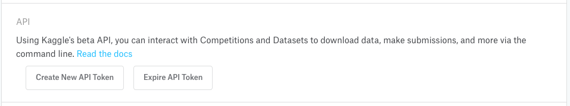

```{r, include = FALSE}
knitr::opts_chunk$set(
  collapse = TRUE,
  comment = "#>"
)
```

```{r setup}
library(kaggler)
```

# API key setup

<span>1.</span> Go to [https://www.kaggle.com/](kaggle.com) and sign in

<span>2.</span> Click `Account` or navigate to `https://www.kaggle.com/{username}/account`

<span>3.</span> Scroll down to the `API` section and click `Create New API Token` (which should cause you to download a `kaggle.json` file with your username and API key)

```{r, echo=FALSE, fig.align="center", out.width="75%"}

```

<span>4.</span> Save the `kaggle.json` file in a location you can easily locate the path for such as the `Downloads/` folder

<span>5.</span> Copy the `kaggle.json` file to `~/.kaggle/kaggle.json`

  - There is a helper function, `kgl_auth_file_setup()` that takes the path of the saved `kaggle.json` file and *copies* it to the required directory
  
<span>6.</span> Thats it! When calling any of the `{kaggler}` functions the authorization function will check for that file and create an environment variable, `KAGGLE_PAT`, in your `.Renviron` file

  - You can view and edit their .Renviron with `usethis::edit_r_environ()`
